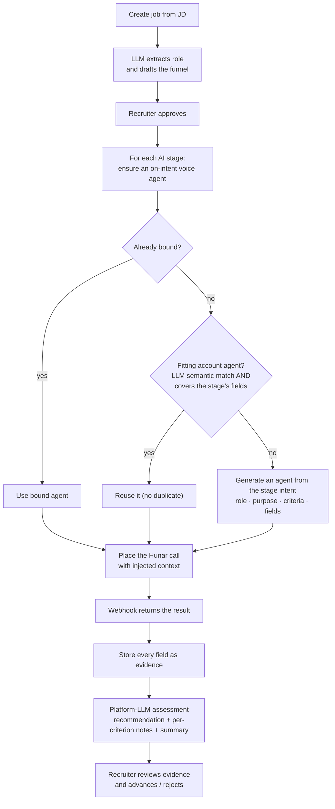
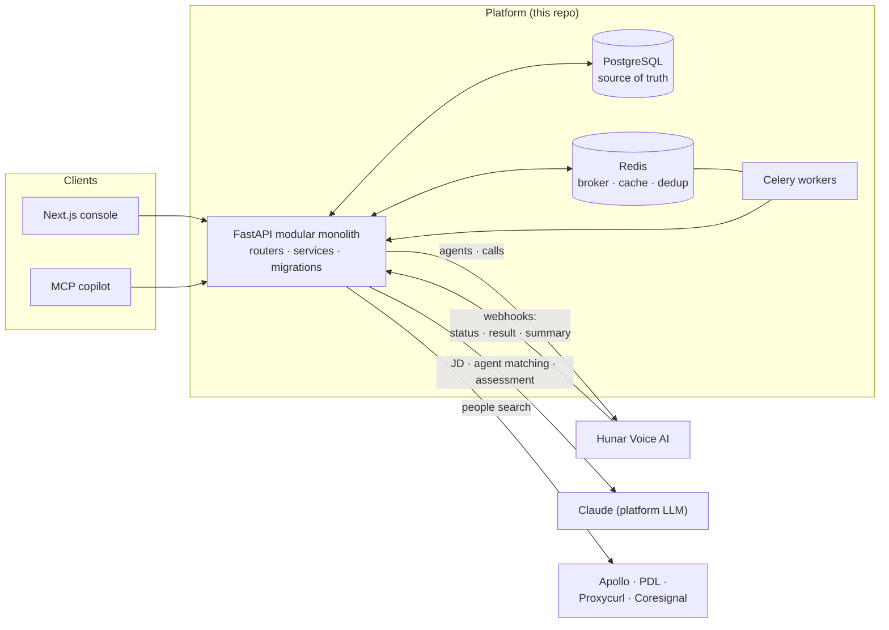
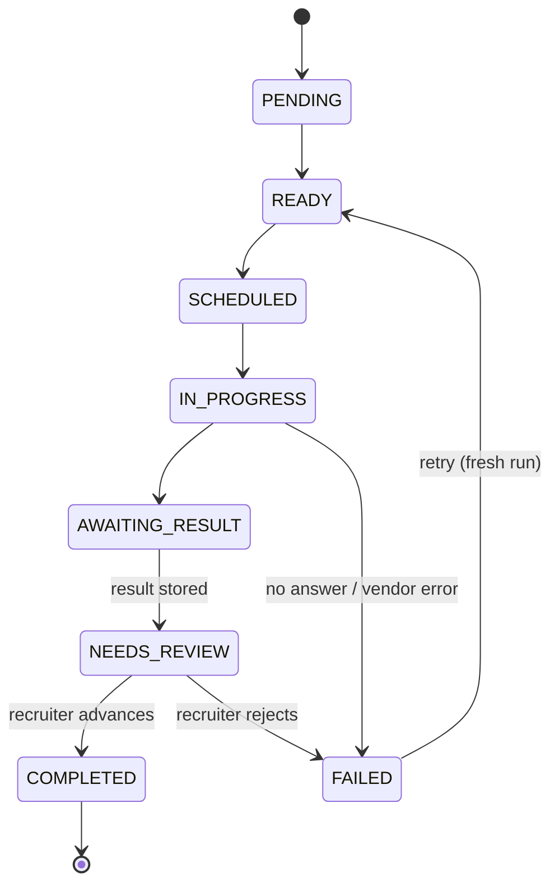

# AI Recruitment Workflow

A production-oriented AI recruitment and workforce-operations platform. **Hunar** is the
voice / conversation execution layer; **this platform** owns the product workflow,
orchestration, state, data, UI, approvals, policies, evidence, and operational visibility.

> Tell the platform who you need to hire → confirm how you want to evaluate them →
> add or find candidates → let the platform orchestrate the hiring funnel →
> review evidence and make decisions.

The application is **built and working end to end**: `apps/api` (FastAPI backend),
`apps/web` (Next.js console), and `apps/mcp` (MCP server). Both core journeys run —
existing candidates → AI interview, and people-search → outreach across four real providers
(Apollo / PDL / Proxycurl / Coresignal; PDL verified live) — plus Settings, team invites,
CSV bulk import, a paginated candidate pipeline, and a conversational copilot.

---

## Assignment submission

This repository answers the take-home assignment:

1. **AI Hiring Assistant — Voice AI agents (Hunar.AI).** ✅ Built. A recruiter creates a job
   from a JD, the platform drafts and (on human approval) provisions **one voice agent per hiring
   stage**, places the calls through Hunar, and turns each call's result into structured evidence
   plus an AI assessment. See **[The intelligent hiring flow](#the-intelligent-hiring-flow-f-009)**.
2. **People Search & Reachout.** ✅ Built. Paste a JD → search people across **Apollo / PDL /
   Proxycurl / Coresignal** → add matches to the pipeline → reach out with a Voice AI agent →
   responses land back in the candidate dashboard as evidence. See **Sourcing** below.
   > The **Apollo and PDL adapters are implemented and tested** end-to-end. They return live
   > results only with a valid API key **that has available credits**. The keys used during
   > development are out of credits, so live search currently returns no rows — **add your own key
   > in Settings → Sourcing** (or via env) and it works immediately. With no key configured, the
   > app falls back to an offline sample provider so the flow is still demonstrable.
3. **"No smartphones, track attendance of 1000 people across 100 locations."** — answered in a
   **separate design document** (submitted alongside this repo).

**Submission links**

| | |
| --- | --- |
| **GitHub repository** | https://github.com/rishabh2023/ai-recruitment |
| **Deployed solution** | _<add your deployed URL here before submitting>_ |

> **Security note:** the Hunar API key is a secret and lives only in a git-ignored `.env` — it is
> **not** in this repo or README. Provide your own keys in `.env` (see [Quick start](#quick-start-local)).
> The assignment's temporary key is time-limited and may already be revoked.

---

## The intelligent hiring flow (F-009)

The differentiator is that **each funnel stage is backed by a voice agent that understands that
stage** — the role, the stage's purpose, and exactly what it must collect or assess — instead of
one global agent screening everyone.



- **Reuse-or-create, coverage-aware** — an existing agent is reused only if it collects/assesses
  everything the stage needs; otherwise a purpose-built agent is generated. A screening agent is
  never reused for a technical interview.
- **Purpose-shaped scripts** — screening, technical interview, hiring-manager, sales, and
  compensation stages each get an appropriate conversation; **technical stages interview against
  the stage's success criteria**.
- **Evidence by construction** — the generated agent's result schema equals what the stage
  collects, and the platform stores **every field Hunar returns** — nothing silently dropped.
- **Recruiter-safe** — recruiters see "the voice agent for this stage" (view / override / edit its
  objective and fields); Hunar agent ids and prompts are never exposed.
- **Guarded** — provisioning and live calls require the org's live-calling switch + authorization;
  the global default agent is a surfaced last-resort fallback only.

See [`docs/features/F-009-per-stage-voice-agent-provisioning.md`](docs/features/F-009-per-stage-voice-agent-provisioning.md).

---

## Architecture at a glance

A modular monolith: PostgreSQL is the durable source of truth, Redis + Celery run durable async
work, **Hunar** owns the candidate-facing voice conversation, and the **platform LLM** is used only
for product intelligence Hunar doesn't provide (JD understanding, agent matching, assessment).



The candidate stage-run lifecycle (each execution of one stage for one candidate):



---

## Repository layout

```
apps/
  api/    FastAPI modular monolith — routers, per-module services, Alembic migrations, tests
  web/    Next.js + React + TypeScript recruiter console
  mcp/    MCP server exposing the platform to Claude Code / ChatGPT
docs/     Canonical docs (architecture, domain, interfaces, experience, features, vendor matrix)
infra/    Infrastructure / deployment assets
scripts/  Dev + CI helper scripts
compose.yaml   Local Postgres + Redis
```

## Stack

| Concern         | Choice                                             |
| --------------- | -------------------------------------------------- |
| Frontend        | Next.js 15 + React + TypeScript                    |
| Backend         | FastAPI + Python 3.12+ (modular monolith)          |
| Database        | PostgreSQL (durable business source of truth)      |
| Background work | Redis + Celery                                     |
| Voice execution | Hunar                                              |
| People search   | Apollo / PDL / Proxycurl / Coresignal              |
| Platform LLM    | Claude (JD understanding, drafting) — optional     |
| Observability   | OpenTelemetry + Sentry                             |

---

## Quick start (local)

**Prerequisites:** Docker (Postgres + Redis), Python 3.12+, Node 18+.

### 1. Configure environment

```bash
cp .env.example .env                          # fill in values (all optional for the offline stub)
cp apps/web/.env.local.example apps/web/.env.local
```

`.env` and every nested `.env` / `.env.local` are git-ignored — **never commit real keys.**
With all keys blank the app still runs: JD extraction uses a deterministic offline stub,
sourcing reports "provider not configured", and calls stay queued (no live dialing).

### 2. Start infrastructure

```bash
docker compose up -d postgres redis
```

### 3. Backend (`apps/api`) → http://localhost:8000

```bash
cd apps/api
python -m venv .venv && source .venv/bin/activate
pip install -r requirements.txt
alembic upgrade head
uvicorn app.main:app --reload
```

### 4. Frontend (`apps/web`) → http://localhost:3000

```bash
cd apps/web
npm install
npm run dev
```

The web app talks to the backend via `NEXT_PUBLIC_API_URL` (default `http://localhost:8000`).
Use **Sign up** (or the dev bootstrap) to create the first org + admin.

### 5. MCP server (optional)

See [`apps/mcp/README.md`](apps/mcp/README.md) to drive the platform conversationally from
Claude Code / ChatGPT.

---

## Tests

```bash
cd apps/api && source .venv/bin/activate && python -m pytest    # backend (needs Postgres)
cd apps/web && npx tsc --noEmit                                 # frontend type-check
```

Backend tests target a dedicated `*_test` database (auto-derived from `DATABASE_URL`, or set
`TEST_DATABASE_URL`) so they never touch dev data.

---

## Key capabilities

- **Jobs & funnels** — create a role, enter/upload a JD (PDF text is auto-cleaned; scanned PDFs
  fall back to LLM vision), confirm extracted details, draft & approve the hiring **funnel**
  (stages + success criteria), activate.
- **Pipeline** — server-paginated, searchable, stage-filterable candidate table. Add candidates
  in place (with a required country-code selector → E.164 phones) or **bulk-import a CSV**
  (name + mobile mandatory). Per-role de-duplication. Inline edit.
- **Dynamic per-stage voice agents (F-009)** — each AI stage is bound to an on-intent Hunar agent,
  reused (LLM semantic + coverage-aware match) or generated from the stage's role/purpose/criteria.
  Recruiters can view, override, and edit what each stage's agent does.
- **AI interviews** — launch AI stages as Hunar calls (single or "launch for all"); the result is
  stored as evidence, and a **platform-LLM assessment** (recommendation + per-criterion notes +
  summary) is produced for the recruiter. Decisions are persisted and audited; calls dial during
  acceptable hours.
- **Sourcing (People Search & Reachout)** — people search across four providers with recall-tuned
  queries; add matches to the pipeline and reach out with a Voice AI agent. The **Apollo** and
  **PDL** adapters are built and tested; add a credited API key in **Settings → Sourcing** to get
  live results (the dev keys are out of credits). Keys resolve org-first, then env; never returned
  to clients.
- **Settings** — provider keys, live-calling switch, team invites.
- **Audit log** — paginated, searchable, immutable record of consequential actions.

---

## Deployment (in progress)

- **Frontend** → AWS Amplify (Next.js). Set `NEXT_PUBLIC_API_URL` to the backend's public URL.
- **Backend** → EC2 via GitHub Actions CI/CD (Docker image from `apps/api/Dockerfile`; run a
  Celery worker with `CELERY_TASK_ALWAYS_EAGER=0`). Production must set `SESSION_COOKIE_SECURE=1`
  and a correct `CORS_ORIGINS`.

Secrets are supplied via the platform's environment/secret store — **never** committed to git.

**Voice calling & webhooks.** To place real calls, set `HUNAR_API_KEY` and enable live calling
(Settings → live-calling switch, or `HUNAR_LIVE_CALLS_ENABLED=1`). Hunar delivers call
status/result/recording/summary to `POST /webhooks/hunar`, so the backend must be reachable at a
**public** `PUBLIC_BASE_URL` (a production domain, or a tunnel such as `cloudflared` in dev). With
no public URL, calls still run and you can pull results on demand via "Sync from Hunar". Set
`PLATFORM_LLM_API_KEY` (Claude) to enable JD understanding, semantic agent matching, and the
post-call assessment (a deterministic offline stub is used otherwise). The Docker image runs
`alembic upgrade head` on start (`RUN_MIGRATIONS=1`).

---

## Documentation & ground rules

Start with [`PROJECT.md`](PROJECT.md), then [`docs/architecture.md`](docs/architecture.md),
[`docs/interfaces.md`](docs/interfaces.md), and [`docs/features/INDEX.md`](docs/features/INDEX.md).
Agent entry points: [`CLAUDE.md`](CLAUDE.md), [`AGENTS.md`](AGENTS.md).

- No vendor capability is treated as fact unless marked `VERIFIED` in
  [`docs/vendor-capability-matrix.md`](docs/vendor-capability-matrix.md).
- Consequential AI-generated configuration (funnels, rubrics, criteria) requires human approval
  before it executes.
- The platform stays a modular monolith — no microservices/Kubernetes/Kafka unless explicitly
  requested later.
